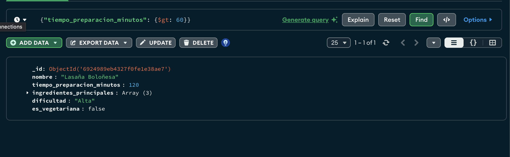

📚 Proyecto: Base de Datos de Recetas con MongoDBEste repositorio contiene la exportación de una colección de documentos de MongoDB, creada como parte de una tarea para aplicar los conceptos de modelado de datos NoSQL y consultas con filtros.🎯 Objetivo del ProyectoCrear una base de datos (mi_db_recetas) en MongoDB.Modelar una colección (recetas) e insertar documentos coherentes (mínimo 3).Realizar consultas filtradas para extraer subconjuntos de datos específicos.Exportar la colección completa en formato JSON.Compartir el resultado en un repositorio de GitHub.💾 Estructura de la Base de DatosEl archivo principal es recetas_export.json, que contiene la colección exportada.Colección: recetasEstructura de Documento (Ejemplo):Cada receta incluye campos clave para la consulta:{
  "nombre": "String",
  "tiempo_preparacion_minutos": "Number",
  "ingredientes_principales": ["Array", "de", "Strings"],
  "dificultad": "String", // Ej: "Baja", "Media", "Alta"
  "es_vegetariana": "Boolean"
}
🔍 Consulta con FiltroPara demostrar la aplicación del filtrado, se ejecutó una consulta que busca todas las recetas cuyo tiempo de preparación es mayor a 60 minutos:Filtro Utilizado en MongoCompass:{
  "tiempo_preparacion_minutos": { $gt: 60 }
}
🖼️ Evidencia del FiltradoA continuación, se adjunta la captura de pantalla que muestra el filtro aplicado en MongoCompass y el resultado obtenido (la receta que cumple con la condición):  Desarrollado para la clase de [Base de Datos 2].
